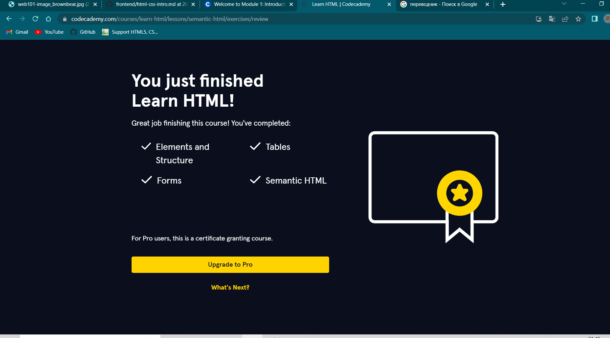
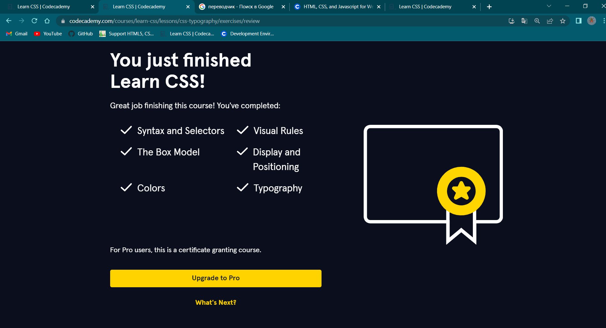

# General
## 0. Git and GitHub
### 1. Introduction to Git and GitHub:
 
During the first phase of learning Git I learned why we need Git a version control system. I got the basic skills of working with Git commands:
+ git init
+ git clone
+ git status
+ git add .
+ git commit -m "some massege"
+ git branch
+ git checkout -b name__branch
+ git push
+ git fetch

And other often used commands.

For the first time, I got experience working with a remote repository GitHub and created my first [repository](https://github.com/DariaYurko/kottans-frontend).
 
 
 

## 1.Linux CLI, and HTTP

### 1. Linux Survival (4 modules)

- [x] Quiz №1
 
- [x] Quiz №2
 
- [x] Quiz №3
 
- [x] Quiz №4
 

 + ___It's new for me.___ 
   There was completely new information for me about the basic knowledge of the Linux CLI.

+ ___It's surprised me.___ 
   Some Linux commands 
   are the same that Windows commands, that I already knew.

+ ___It's what I plan to use in the future.___  
  It will be useful to use the Linux cli in the future, because it has a lot of functionality.

### 2. HTTP

+ ___It's new for me.___ 
   The information I learned about HTTP is difficult to understand in the initial stages of learning.

+ ___It's surprised me.___ 
  Before sending the request to the server, the browser recognizes the IP address by the domain name in DNS, and does not convert it.

+ ___It's what I plan to use in the future.___  
   The responses from the server come as files html, css and js. So it is I will plan to lern and use.
 
 
 

# Front-End Basics
## 3. Intro to HTML & CSS

- [x] HTML 

+ ___It's new for me.___ 
Most of the information that I knew about html is not new for me.
+ ___It's surprised me.___ 
It was interesting to know about the semantic structure and better understand what content is important, what is secondary, what is used for navigation.
+ ___It's what I plan to use in the future.___  
Using of semantic tags will improve the transmission of information for search engines.

- [x] CSS 

+ ___It's new for me.___ 
I learned new information about attribute selectors. This is exactly what I have never used before.

+ ___It's surprised me.___ 
It was interesting to learn that I can connect fonts using the element link and also the same can be done using @import url in css.

+ ___It's what I plan to use in the future.___  
Using attribute selectors I can get more opportunities to detect the occurrence of a substring in an attribute value.

