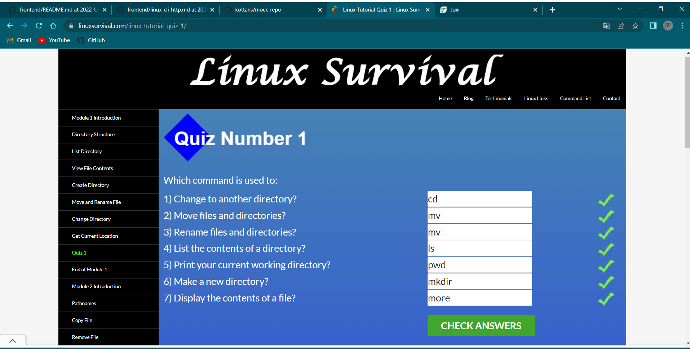
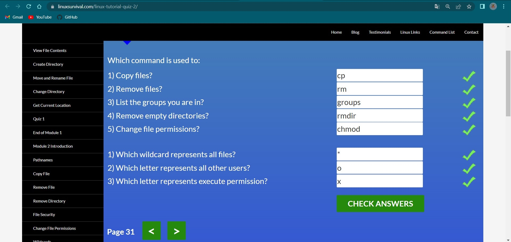
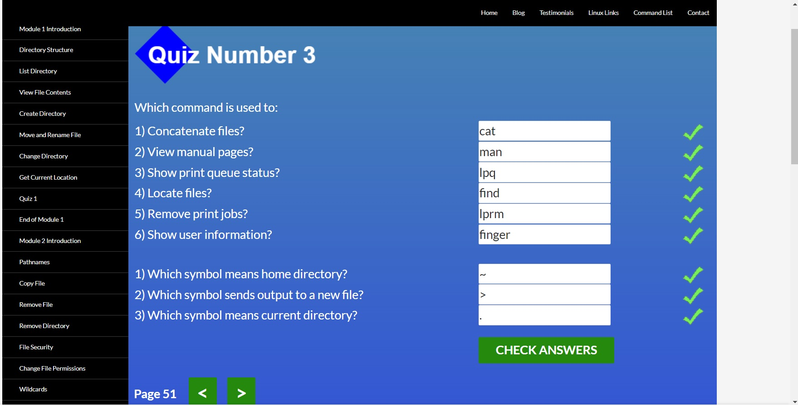
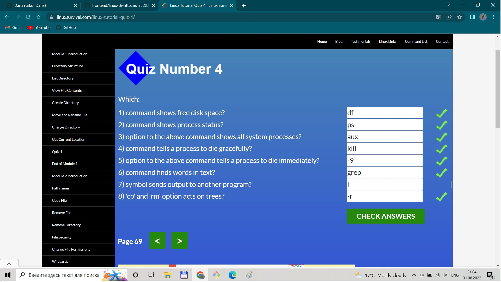

# Git and GitHub
## 1. Introduction to Git and GitHub:
 
___
During the first phase of learning Git I learned why we need Git a version control system. I got the basic skills of working with Git commands:
+ git init
+ git clone
+ git status
+ git add .
+ git commit -m "some massege"
+ git branch
+ git checkout -b name__branch
+ git push
+ git fetch

And other often used commands.

For the first time, I got experience working with a remote repository GitHub and created my first [repository](https://github.com/DariaYurko/kottans-frontend).

# Linux CLI, and HTTP
## 1. Linux Survival (4 modules)
- [x] Quiz №1
 
- [x] Quiz №2
 
- [x] Quiz №3
 
- [x] Quiz №4
 

### 1.What was new for me?
There was completely new information for me about the basic knowledge of the Linux CLI, except some Windows command line skills that I already knew.

